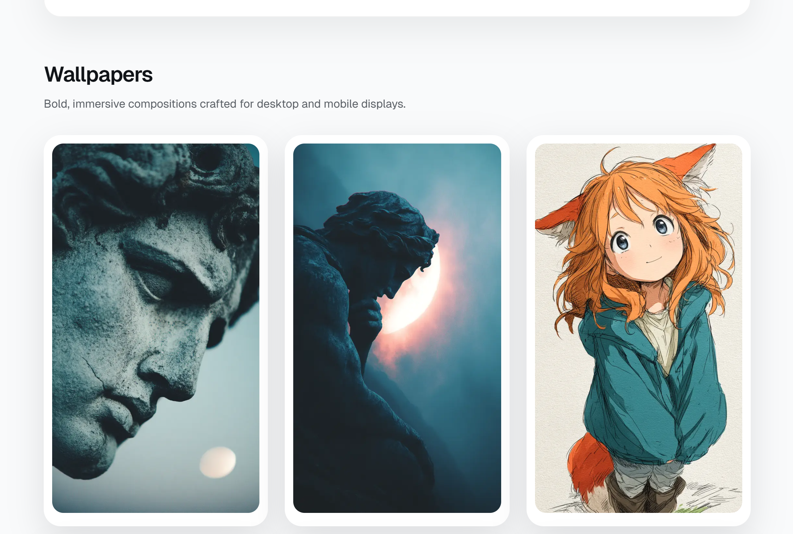
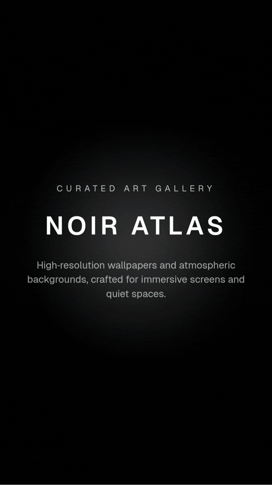

# Noir Atlas — Art Gallery

Noir Atlas is a modern, minimalist art gallery experience built with Next.js. It showcases high-resolution wallpapers and atmospheric backgrounds with immersive text and image motion, a cinematic loading sequence, and a clean, editorial layout.





## Highlights

- Cinematic loader with bold typography and ambient glow
- Scroll-triggered text and image reveals
- Clean grid layout for consistent 4-column rows
- Fullscreen preview modal with download and share actions
- Custom download filenames based on artwork metadata
- Accessible motion with reduced-motion support

## Getting Started

Install dependencies and run the dev server:

```bash
npm install
npm run dev
```

Open http://localhost:3000 to view the site.

## Project Structure

- src/app/page.tsx — main gallery layout and interactions
- src/app/globals.css — global styles, animations, and effects
- public/wallpapers — wallpaper assets
- public/backgrounds — background assets

## Notes

The gallery images are served from the public folder. Download filenames are generated from the artwork title and category.
