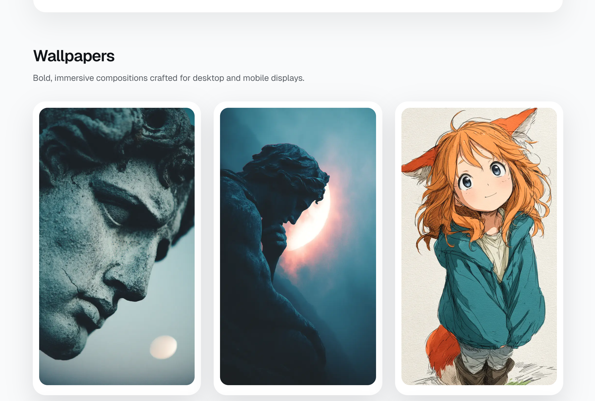
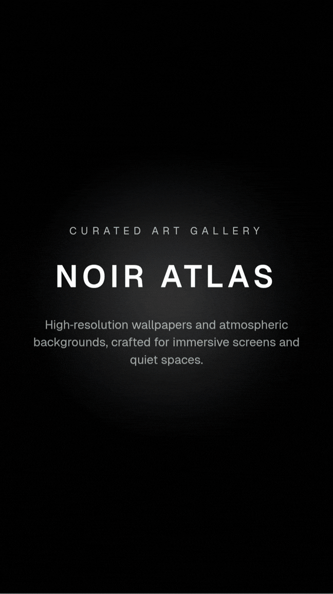

# NOIR ATLAS - Personal Art Gallery 🎨

**NOIR ATLAS** is my personal online art gallery where I share a curated collection of original AI-generated artworks and illustrations.
Each artwork is refined into high-resolution wallpapers and atmospheric background designs. Some of my works are published on stock platforms, and selected pieces are shared here for free personal use.
Every release is designed to look clean and balanced on all screen sizes - from mobile phones to ultra-wide monitors 🖥️📱
The website is built with Next.js and focuses on a cinematic layout, smooth motion, and minimal design so the artwork remains the main focus ✨

  

## Automation System ⚡

The project includes a GitHub Actions workflow that automatically manages the gallery data.

The system automatically:

- 📂 Scans all images inside `public/wallpapers` and `public/backgrounds`
- ⚡ Generates `src/data/gallery.json`
- 🧠 Sorts images by file modified time (newest first)
- 🔄 Updates the JSON file inside the repository
- 🚀 Triggers automatic deployment on Vercel

👉 **Result:** Just add an image → push → website updates automatically

## Preview 👀

<table>
  <tr>
    <td align="center">
      <strong>Desktop Experience</strong> 
      
    </td>
    <td align="center">
      <strong>Mobile Experience</strong> 
      
    </td>
  </tr>
</table>

## About the Collection 🖼️

Noir Atlas is a **personal art archive**, not a stock marketplace.
It features selected AI artworks carefully prepared as premium-quality visual assets. These are shared freely with the community for personal use.

### Categories

- Wallpapers  
- Backgrounds  

All downloads are provided in full quality with no watermarks.

## Usage & License 📜

**Free to download - for personal use only.**

### You may:

- Use the artworks on your personal devices 💻  
- Share the original files with proper credit 🙌  

### You may not:

- Use the artworks in commercial projects ❌  
- Resell or redistribute them as stock ❌  
- Include them in paid products or services ❌  

For commercial use, please contact me directly.

## Creator ✍️

**[Danidu Muhandiram](https://github.com/Danidu-Muhandiram)**
Designer & Developer  

I publish designs on stock platforms and share selected artworks here as free downloads for the community 🤍

## Tech Stack 🛠️

- Next.js  
- React  
- TypeScript  
- Tailwind CSS  
- Custom CSS animations

⭐ **If you found this project helpful, please give it a star!** ⭐

